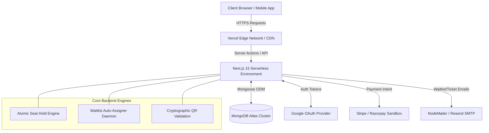
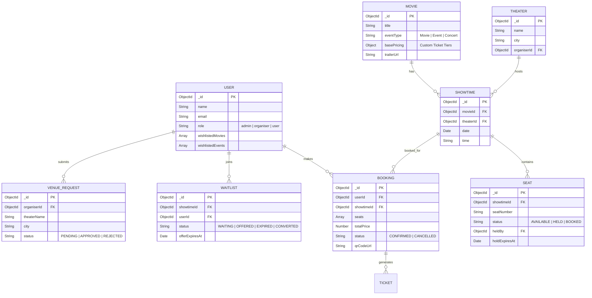
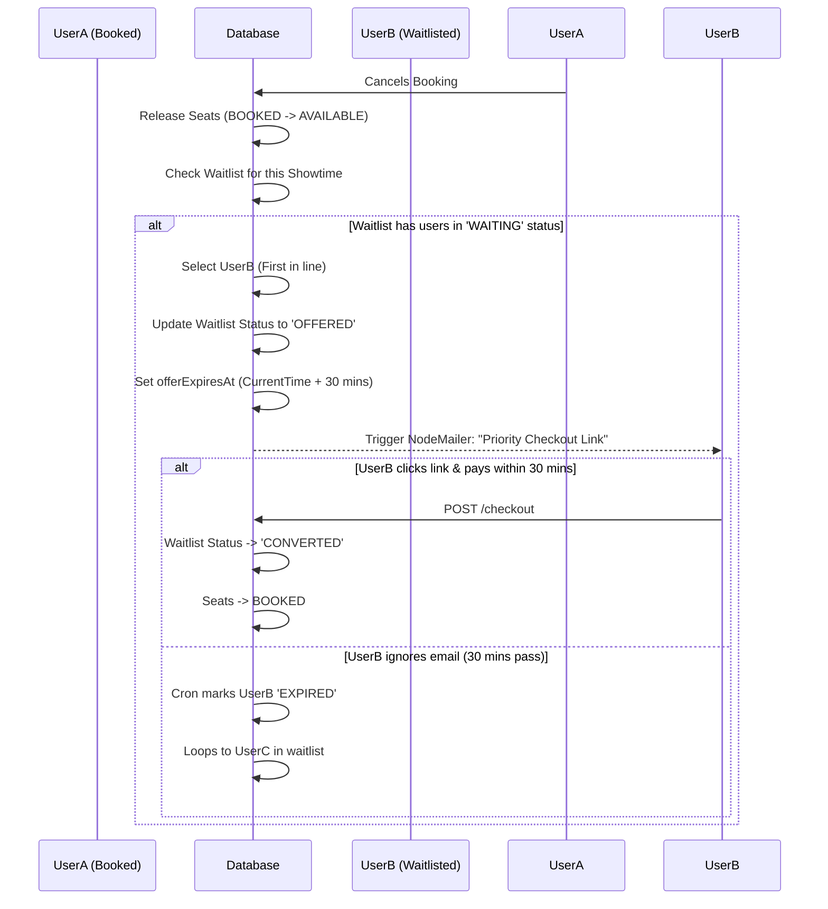

<div align="center">
  <h1>🍿 CineVerse</h1>
  <p><strong>Advanced Ticketing & Event Management Platform</strong></p>
  
  
  
  
  
  
</div>

<br/>

CineVerse is a highly scalable, multi-tenant ticketing platform built with Next.js 15, MongoDB, and TailwindCSS. It features a complete tripartite architecture designed for Admins, Theatre/Event Organizers, and Customers, simulating the core engine of industry-leading platforms.

## 🚀 Live Demo & Environments

**Live Application URL:** [https://events-ticket-booking.vercel.app](https://events-ticket-booking.vercel.app) *(Update with your actual Vercel/Render URL)*

To experience the full system architecture, use the following pre-configured demo accounts:

1. **Admin / Superuser** (Full system control)
   - Email: `yashshende9999@gmail.com`
   - Password: `123456`
2. **Organizer** (Pre-loaded with 26 Movies & Events, Revenue Dashboards)
   - Email: `yash.22310893@viit.ac.in`
   - Password: `123456`
3. **Customer / User** (Booking flow, waitlists, checkout)
   - Email: `hvdpvd4@gmail.com`
   - Password: `123456`

## ✨ Key Technical Achievements

- 🎟️ **Unified Super Schema:** Supports both traditional Movie Screenings (with interactive seat mapping) and Live Events (with dynamic pricing tiers) seamlessly.
- ⚡ **High-Concurrency Seat Holding Engine:** Prevents double-booking using atomic database transactions and a strict 10-minute hold TTL via database-level expiry.
- 🤖 **Automated Waitlist Processing:** Automatically detects cancelled bookings, pulls the next user from the queue, and emails a time-limited (30 mins) priority checkout link.
- 📱 **Hardware-Integrated QR Validation:** Organizers can scan cryptographic Ticket QRs at the venue door using webcams or hardware barcode scanners for instant validation.
- 📊 **Real-time Analytics Dashboard:** Dynamic Recharts integration showing ticket sales trends, category-wise revenue distribution, and robust event performance comparisons.

## 1. System Architecture

The platform operates on a modernized **Next.js 15 App Router** architecture, leveraging React Server Components for highly optimized initial page loads (SEO-friendly) and Client Components for dynamic, real-time interactivity (Seat Map selection).



### Key Architectural Decisions:
- **Serverless API Routes:** Backend logic is deployed as stateless, horizontally scalable Serverless Functions on Vercel.
- **Optimistic UI Updates:** The React frontend utilizes optimistic state rendering to ensure the seat map feels instantaneous, verifying state asynchronously in the background.
- **Tripartite Authorization:** Middleware heavily protects `/admin/*` and `/organiser/*` routes, enforcing strict JWT claims to ensure tenant isolation.

---

## 2. Database Schema Overview (ER Diagram)

The database strictly enforces relational integrity within a NoSQL environment using Mongoose `ObjectIds` and `Populate` commands.


    USER {
        ObjectId _id
        String name
        String email
        String role "admin | organiser | user"
    }

    THEATER ||--o{ MOVIE : hosts
    THEATER {
        ObjectId _id
        String name
        String city
        ObjectId organiserId
    }

    MOVIE ||--o{ SHOWTIME : has
    MOVIE {
        ObjectId _id
        String title
        String eventType "Movie | Event | Concert"
        Object basePricing "Custom Ticket Tiers"
    }

    SHOWTIME ||--o{ SEAT : contains
    SHOWTIME ||--o{ BOOKING : booked_for
    SHOWTIME {
        ObjectId _id
        ObjectId movieId
        ObjectId theaterId
        Date date
        String time
    }

    SEAT {
        ObjectId _id
        ObjectId showtimeId
        String seatNumber
        String status "AVAILABLE | HELD | BOOKED"
        ObjectId heldBy
        Date holdExpiresAt
    }

    BOOKING ||--o{ TICKET : generates
    BOOKING {
        ObjectId _id
        ObjectId userId
        ObjectId showtimeId
        Number amount
        String status "CONFIRMED | CANCELLED"
    }

    WAITLIST {
        ObjectId _id
        ObjectId showtimeId
        ObjectId userId
        String status "WAITING | OFFERED | EXPIRED | CONVERTED"
        Date offerExpiresAt
    }
```

---

## 3. High-Concurrency & Concurrency Explanation

### The Double-Booking Threat
In high-demand ticketing scenarios (e.g., a massive Marvel movie release or a Taylor Swift concert), it is common for thousands of users to view the exact same Seat Map simultaneously. If 100 users click on seat `A1` at the exact same millisecond, a standard dual-step database query (`find()` -> verify -> `save()`) creates a massive Race Condition. Multiple users will successfully bypass the verification step before the database commits the first save, resulting in catastrophic double-booking.

### The Solution: MongoDB Atomic Operations
We completely eliminate application-level race conditions by pushing the concurrency check directly to the database lock level using MongoDB's atomic `findOneAndUpdate` combined with strict conditional matching.

**The Execution Logic:**
```javascript
// Serverless API Action (/hold-seats)
const seat = await Seat.findOneAndUpdate(
  {
    _id: requestedSeatId,
    showtimeId: currentShowtimeId,
    status: "AVAILABLE", // CRITICAL: Strict exact-match condition
  },
  {
    $set: {
      status: "HELD",
      heldBy: currentUserId,
      holdExpiresAt: new Date(Date.now() + 10 * 60 * 1000) // Exactly 10 Minute TTL
    }
  },
  { new: true } // Return updated document if successful
);

if (!seat) {
    throw new Error("Seat already taken or held by another user.");
}
```

### How the Engine Works:
1. **Atomic Exclusivity:** MongoDB applies a document-level lock during `findOneAndUpdate`. If 100 threads execute this query simultaneously, the first thread locks the document, verifies `status: "AVAILABLE"`, and updates it to `HELD`. 
2. **Instant Rejection:** By the time the lock releases for the remaining 99 threads, the `status` is no longer `"AVAILABLE"`. The query condition fails, returning `null`, and the backend safely throws a "Seat Unavailable" exception. No double-bookings ever occur.
3. **Time-To-Live (TTL) Auto-Release:** Once a seat is marked as `HELD`, the user is granted exactly 10 minutes to complete the checkout/payment flow. The database relies on `holdExpiresAt`. If a user abandons the checkout, a background cleanup daemon (or dynamic read-time evaluator) seamlessly releases the seat back to the pool, triggering live UI updates for other customers.

---

## 4. Waitlist Auto-Assignment Flow



---

## 5. Setup & Local Development Guide

<details>
<summary><strong>🛠️ Click to expand setup instructions</strong></summary>

### Prerequisites
- Node.js 18+
- MongoDB instance (Atlas or local)
- Google Cloud Console account (for OAuth)

### Environment Variables (`.env.local`)
Create a `.env.local` file in the root directory:
```env
MONGODB_URI=mongodb+srv://<user>:<password>@cluster...
NEXTAUTH_SECRET=generate_a_random_secure_string
NEXTAUTH_URL=http://localhost:3000

# Google OAuth
GOOGLE_CLIENT_ID=your_google_client_id
GOOGLE_CLIENT_SECRET=your_google_client_secret

# Email Service (for QR & Waitlist)
EMAIL_SERVER_USER=your_email@gmail.com
EMAIL_SERVER_PASSWORD=your_app_password
```

### Installation

1. Clone the repository
```bash
git clone https://github.com/yash-shende99/events-ticket-booking.git
cd events-ticket-booking
```

2. Install dependencies
```bash
npm install
# or
yarn install
```

3. Run the development server
```bash
npm run dev
# or
yarn dev
```

4. Open [http://localhost:3000](http://localhost:3000) with your browser.

</details>

---

## 6. Project Structure (Monorepo)

```text
├── src/
│   ├── app/                # Next.js 15 App Router Pages & API Routes
│   │   ├── (auth)/         # Authentication & Login flows
│   │   ├── admin/          # Admin Superuser Dashboards
│   │   ├── api/            # Serverless Backend Endpoints
│   │   ├── organiser/      # Venue & Event Management Dashboards
│   │   ├── movies/         # Public Facing Movie Discovery
│   │   └── events/         # Public Facing Event Discovery
│   ├── components/         # Reusable React UI Components (Tailwind)
│   ├── lib/                # Database connections, Auth options, Utils
│   └── models/             # Mongoose Schemas (User, Movie, Ticket)
├── public/                 # Static assets (fonts, icons, default images)
└── tailwind.config.ts      # Global styling system
```

---

## 7. API Design & Documentation

- `POST /api/showtimes/[id]/hold-seats` - Validates seat availability and atomically applies a hold TTL.
- `POST /api/showtimes/[id]/book` - Finalizes a payment session and converts HELD seats to BOOKED.
- `POST /api/waitlist/[id]/join` - Adds a user to the seat waitlist queue.
- `POST /api/wishlist` - Synchronizes user event interest tracking.
- `GET /api/organiser/stats` - Aggregates secure venue-level revenue analytics for the Organizer dashboard.

---

## 📸 8. Screenshots

*(Replace the placeholder URLs with actual screenshots from your repository. You can upload them to a `/public/docs` folder or host them via GitHub issues/imgur).*

### Customer Flow (Seat Selection & YouTube Trailers)


### Organizer Dashboard (Revenue Analytics)


## 👨‍💻 10. Author / Contact

**Yash Shende**
- **Email:** yashshende9999@gmail.com
- **LinkedIn:** [Insert your LinkedIn URL here]
- **GitHub:** [https://github.com/yash-shende99](https://github.com/yash-shende99)