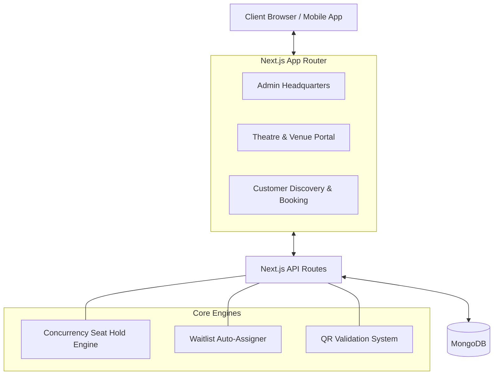
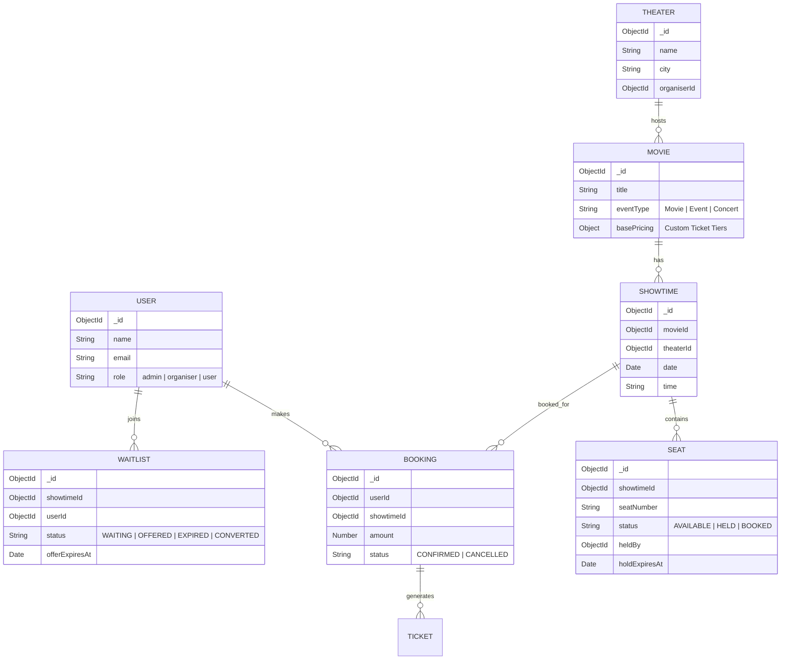
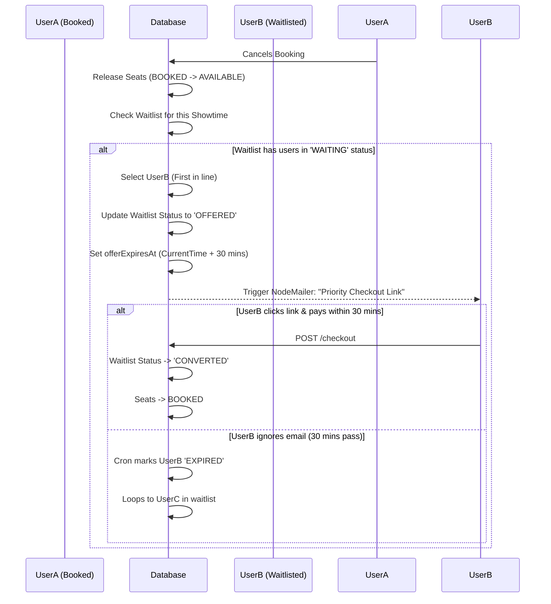

# CineVerse - Advanced Ticketing & Event Management Platform

CineVerse is a highly scalable, multi-tenant ticketing platform built with Next.js 15, MongoDB, and TailwindCSS. It features a complete tripartite architecture designed for Admins, Theatre/Event Organizers, and Customers, simulating the core engine of platforms like BookMyShow or Ticketmaster.

## 🚀 Live Demo & Environments

**Live Application URL:** [https://events-ticket-booking.vercel.app](https://events-ticket-booking.vercel.app) *(Update with your actual Vercel/Render URL)*

To experience the full system architecture, use the following pre-configured demo accounts:

1. **Admin / Superuser** (Full system control)
   - Email: `yashshende9999@gmail.com`
   - Password: *(Google OAuth / NextAuth configured)*
2. **Organizer** (Pre-loaded with 26 Movies & Events, Revenue Dashboards)
   - Email: `yash.22310893@viit.ac.in`
   - Password: *(Google OAuth / NextAuth configured)*
3. **Customer / User** (Booking flow, waitlists, checkout)
   - Email: `hvdpvd4@gmail.com`
   - Password: *(Google OAuth / NextAuth configured)*

## ✨ Key Technical Achievements

- **Unified Super Schema:** Supports both traditional Movie Screenings (with interactive seat mapping) and Live Events (with dynamic pricing tiers) seamlessly.
- **High-Concurrency Seat Holding Engine:** Prevents double-booking using atomic database transactions and a strict 10-minute hold TTL via database-level expiry and real-time state calculation.
- **Automated Waitlist Processing:** Automatically detects cancelled bookings, pulls the next user from the queue, and emails a time-limited (30 mins) priority checkout link.
- **Hardware-Integrated QR Validation:** Organizers can scan cryptographic Ticket QRs at the venue door using webcams or hardware barcode scanners for instant validation.
- **Real-time Analytics Dashboard:** Dynamic Recharts integration showing ticket sales trends, category-wise revenue distribution, and robust event performance comparisons.

---

## 📸 Screenshots

*(Replace the placeholder URLs with actual screenshots from your repository. You can upload them to a `/public/docs` folder or host them via GitHub issues/imgur).*

### Customer Flow (Seat Selection & YouTube Trailers)


### Organizer Dashboard (Revenue Analytics)


---

## 1. System Architecture



---

## 2. Database Schema Overview (ER Diagram)



---

## 3. High-Concurrency Concurrency Explanation

### The Double-Booking Problem
If 100 users try to book seat "A1" at the exact same millisecond, a standard `find` and `update` query will result in multiple users successfully claiming the seat, leading to catastrophic double-booking.

### Our Solution (Atomic Updates)
We rely on MongoDB's atomic `findOneAndUpdate` combined with strict query conditions to guarantee absolute concurrency safety.

**The Query Logic:**
```javascript
const seat = await Seat.findOneAndUpdate(
  {
    _id: seatId,
    showtimeId: showtimeId,
    status: "AVAILABLE", // CRITICAL: Only match if strictly available
  },
  {
    $set: {
      status: "HELD",
      heldBy: userId,
      holdExpiresAt: new Date(Date.now() + 10 * 60 * 1000) // 10 Min TTL
    }
  },
  { new: true }
);
```

Because MongoDB guarantees atomicity at the document level, if 100 threads hit this query simultaneously, only the *first* thread will find a document where `status === "AVAILABLE"`. The remaining 99 threads will return `null` and instantly fail the booking flow, completely eliminating race conditions.

---

## 4. Waitlist Auto-Assignment Flow



---

## 5. Setup & Local Development Guide

### Prerequisites
- Node.js 18+
- MongoDB instance (Atlas or local)
- Google Cloud Console account (for OAuth)

### Environment Variables (`.env.local`)
Create a `.env.local` file in the root directory:
```env
MONGODB_URI=mongodb+srv://<user>:<password>@cluster...
NEXTAUTH_SECRET=generate_a_random_secure_string
NEXTAUTH_URL=http://localhost:3000

# Google OAuth
GOOGLE_CLIENT_ID=your_google_client_id
GOOGLE_CLIENT_SECRET=your_google_client_secret

# Email Service (for QR & Waitlist)
EMAIL_SERVER_USER=your_email@gmail.com
EMAIL_SERVER_PASSWORD=your_app_password
```

### Installation

1. Clone the repository
```bash
git clone https://github.com/yash-shende99/events-ticket-booking.git
cd events-ticket-booking
```

2. Install dependencies
```bash
npm install
# or
yarn install
```

3. Run the development server
```bash
npm run dev
# or
yarn dev
```

4. Open [http://localhost:3000](http://localhost:3000) with your browser.

---

## 6. API Design & Documentation

- `POST /api/showtimes/[id]/hold-seats` - Validates seat availability and atomically applies a hold TTL.
- `POST /api/showtimes/[id]/book` - Finalizes a payment session and converts HELD seats to BOOKED.
- `POST /api/waitlist/[id]/join` - Adds a user to the seat waitlist queue.
- `POST /api/wishlist` - Synchronizes user event interest tracking.
- `GET /api/organiser/stats` - Aggregates secure venue-level revenue analytics for the Organizer dashboard.